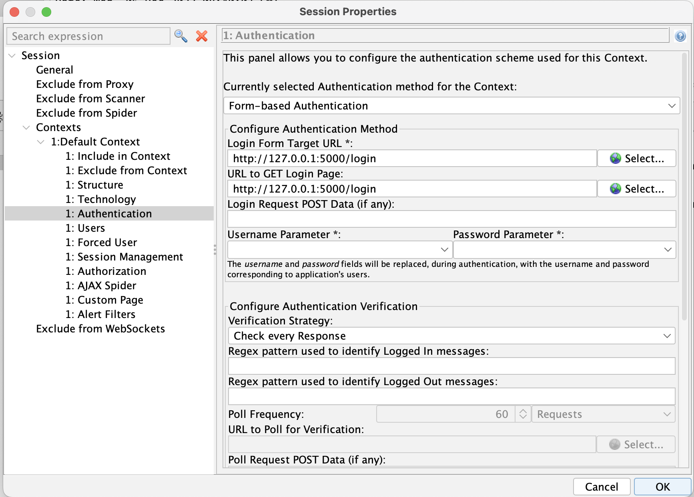
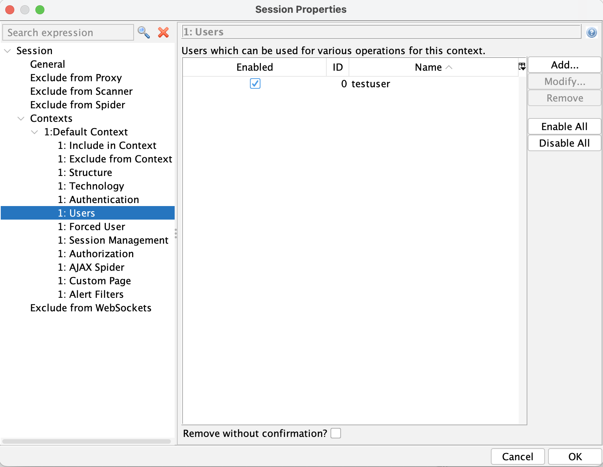
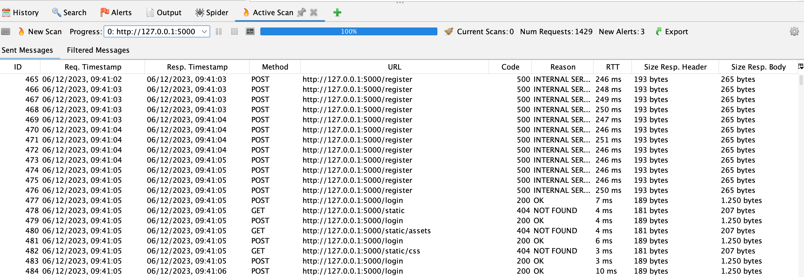

## Introduction

For the course 183 i created a full-stack application in flask. This application consists of a classic html/css/javascript frontend and a python backend connected to a sqlite database.

This course focuses on and we were introduced to multiple tools for scanning existing applications for security vulnerabilities. Using these tools i want to improve the security of my existing full-stack application.

## Scanning for vulnerabilities

To scan for these vulnerabilities i used Zed Attack Proxy (ZAP) which they themselves call:

>The world’s most widely used web app scanner. Free and open source. Actively maintained by a dedicated international team of volunteers. A GitHub Top 1000 project. 

The application has different modes for scanning. I used the automatic mode which prompts for the url of the web application.
#### Session Authentication

To allow the scan to also post correct information during login / authentication we can add the login target url (POST) and the URL to GET Login page to our context under session properties. In my case these are on the surl.



We can then also add a User with correct credentials to be used when accessing the login page during our scan.



### Scan

The scan is then done automatically and the submitted requests are shown under *Active scan*



### Scan results

I let ZAP output the results into an HTML report. I then used ChatGPT to summarise this report:

### Summary of ZAP Scanning Report

#### Report Details
- **ZAP Version:** 2.14.0
- **Generated:** Wed 6 Dec 2023, at 09:50:17

#### About this Report
- **Contexts:** All contexts included
- **Sites:** Included site - [http://127.0.0.1:5000](http://127.0.0.1:5000)
- **Risk Levels Included:** High, Medium, Low, Informational
- **Confidence Levels Included:** User Confirmed, High, Medium, Low
- **Exclusions:** None

#### Summaries
- **Alert Counts by Risk and Confidence:**
  - High-Risk Alerts: 3 (27.3%)
  - Medium-Risk Alerts: 6 (54.5%)
  - Low-Risk Alerts: 2 (18.2%)
  - Informational-Risk Alerts: 0 (0.0%)

- **Alert Counts by Site and Risk:**
  - [http://127.0.0.1:5000](http://127.0.0.1:5000)
    - High Risk: 2 alerts
    - Medium Risk: 3 alerts
    - Low Risk: 4 alerts
    - Informational: 2 alerts

- **Alert Counts by Alert Type and Risk:**
  - Path Traversal: 1 (High Risk - 9.1%)
  - SQL Injection: 1 (High Risk - 9.1%)
  - Absence of Anti-CSRF Tokens: 3 (Medium Risk - 27.3%)
  - Content Security Policy (CSP) Header Not Set: 8 (Medium Risk - 72.7%)
  - Missing Anti-clickjacking Header: 5 (Medium Risk - 45.5%)
  - Application Error Disclosure: 1 (Low Risk - 9.1%)
  - Information Disclosure - Debug Error Messages: 1 (Low Risk - 9.1%)
  - Server Leaks Version Information via "Server" HTTP Response Header Field: 12 (Low Risk - 109.1%)
  - X-Content-Type-Options Header Missing: 9 (Low Risk - 81.8%)
  - GET for POST: 1 (Informational Risk - 9.1%)
  - Information Disclosure - Suspicious Comments: 1 (Informational Risk - 9.1%)

#### Alerts Details
- **High Risk, Medium Confidence:** 1 alert - SQL Injection at [http://127.0.0.1:5000/register](http://127.0.0.1:5000/register)
- **High Risk, Low Confidence:** 1 alert - Path Traversal at [http://127.0.0.1:5000/register](http://127.0.0.1:5000/register)
- **Medium Risk, High Confidence:** 1 alert - CSP Header Not Set at [http://127.0.0.1:5000/sitemap.xml](http://127.0.0.1:5000/sitemap.xml)
- **Medium Risk, Medium Confidence:** 
  - Absence of Anti-CSRF Tokens
  - Missing Anti-clickjacking Header
  - Server Leaks Version Information via "Server" HTTP Response Header Field
- **Low Risk, High Confidence:** 
  - Application Error Disclosure at [http://127.0.0.1:5000/register](http://127.0.0.1:5000/register)
  - Information Disclosure - Debug Error Messages at [http://127.0.0.1:5000/register](http://127.0.0.1:5000/register)
  - X-Content-Type-Options Header Missing at [http://127.0.0.1:5000/static/css/styles.css](http://127.0.0.1:5000/static/css/styles.css)
  - Information Disclosure - Suspicious Comments at [http://127.0.0.1:5000/register](http://127.0.0.1:5000/register)
- **Informational Risk, High Confidence:** 
  - GET for POST at [http://127.0.0.1:5000/login](http://127.0.0.1:5000/login)
- **Informational Risk, Medium Confidence:** 
  - Information Disclosure - Suspicious Comments at [http://127.0.0.1:5000/register](http://127.0.0.1:5000/register)

## Alerted vulnerabilities

### SQL Injection

SQL Injection at [http://127.0.0.1:5000/register](http://127.0.0.1:5000/register)
#### ZAP additional information

The page results were successfully manipulated using the boolean conditions `[ZAP AND 1=1 -- ]` and `[ZAP AND 1=2 -- ]`
The parameter value being modified was NOT stripped from the HTML output for the purposes of the comparison
Data was returned for the original parameter.
The vulnerability was detected by successfully restricting the data originally returned, by manipulating the parameter
#### ZAPs solution

Do not trust client side input, even if there is client side validation in place.
In general, type check all data on the server side.

If the application uses JDBC, use PreparedStatement or CallableStatement, with parameters passed by '?'

If the application uses ASP, use ADO Command Objects with strong type checking and parameterized queries.

If database Stored Procedures can be used, use them.

Do *not* concatenate strings into queries in the stored procedure, or use 'exec', 'exec immediate', or equivalent functionality!

Do not create dynamic SQL queries using simple string concatenation.

Escape all data received from the client.

Apply an 'allow list' of allowed characters, or a 'deny list' of disallowed characters in user input.

Apply the principle of least privilege by using the least privileged database user possible.

In particular, avoid using the 'sa' or 'db-owner' database users. This does not eliminate SQL injection, but minimizes its impact.

Grant the minimum database access that is necessary for the application.
#### Flask Solution

1. **Parameterized Queries:** Use parameterized queries or prepared statements provided by the database libraries (e.g., SQLAlchemy) in Flask. These help separate SQL logic from user inputs, preventing direct concatenation of user data into SQL queries.

Example using SQLAlchemy ORM:

```python
from flask_sqlalchemy import SQLAlchemy  

# Assuming `db` is your SQLAlchemy
object result = db.session.execute("SELECT * FROM users WHERE username = :username", {"username": user_input})
```

2. **ORM (Object-Relational Mapping):** Prefer using ORM libraries like SQLAlchemy, which offer ORM features and automatically handle parameterization and sanitation of SQL queries.

Example using SQLAlchemy ORM:

```python
from flask_sqlalchemy import SQLAlchemy  

# Assuming `db` is your SQLAlchemy object and User is the model
users = User.query.filter_by(username=user_input).all()
```


3. **Input Validation and Sanitization:** Validate and sanitize user inputs to ensure they match expected data types and formats. Use validation libraries or custom validation logic to prevent malicious inputs.

Example using SQLAlchemy ORM and Markup:

```python
from flask import Markup
from flask_sqlalchemy import SQLAlchemy
```

### Path traversal

Path Traversal at [http://127.0.0.1:5000/register](http://127.0.0.1:5000/register)
#### ZAPs solution

Assume all input is malicious. Use an "accept known good" input validation strategy, i.e., use an allow list of acceptable inputs that strictly conform to specifications. Reject any input that does not strictly conform to specifications, or transform it into something that does. Do not rely exclusively on looking for malicious or malformed inputs (i.e., do not rely on a deny list). However, deny lists can be useful for detecting potential attacks or determining which inputs are so malformed that they should be rejected outright.

When performing input validation, consider all potentially relevant properties, including length, type of input, the full range of acceptable values, missing or extra inputs, syntax, consistency across related fields, and conformance to business rules. As an example of business rule logic, "boat" may be syntactically valid because it only contains alphanumeric characters, but it is not valid if you are expecting colors such as "red" or "blue."

For filenames, use stringent allow lists that limit the character set to be used. If feasible, only allow a single "." character in the filename to avoid weaknesses, and exclude directory separators such as "/". Use an allow list of allowable file extensions.

Warning: if you attempt to cleanse your data, then do so that the end result is not in the form that can be dangerous. A sanitizing mechanism can remove characters such as '.' and ';' which may be required for some exploits. An attacker can try to fool the sanitizing mechanism into "cleaning" data into a dangerous form. Suppose the attacker injects a '.' inside a filename (e.g. "sensi.tiveFile") and the sanitizing mechanism removes the character resulting in the valid filename, "sensitiveFile". If the input data are now assumed to be safe, then the file may be compromised. 

Inputs should be decoded and canonicalized to the application's current internal representation before being validated. Make sure that your application does not decode the same input twice. Such errors could be used to bypass allow list schemes by introducing dangerous inputs after they have been checked.

Use a built-in path canonicalization function (such as realpath() in C) that produces the canonical version of the pathname, which effectively removes ".." sequences and symbolic links.

Run your code using the lowest privileges that are required to accomplish the necessary tasks. If possible, create isolated accounts with limited privileges that are only used for a single task. That way, a successful attack will not immediately give the attacker access to the rest of the software or its environment. For example, database applications rarely need to run as the database administrator, especially in day-to-day operations.

When the set of acceptable objects, such as filenames or URLs, is limited or known, create a mapping from a set of fixed input values (such as numeric IDs) to the actual filenames or URLs, and reject all other inputs.

Run your code in a "jail" or similar sandbox environment that enforces strict boundaries between the process and the operating system. This may effectively restrict which files can be accessed in a particular directory or which commands can be executed by your software.

OS-level examples include the Unix chroot jail, AppArmor, and SELinux. In general, managed code may provide some protection. For example, java.io.FilePermission in the Java SecurityManager allows you to specify restrictions on file operations.

This may not be a feasible solution, and it only limits the impact to the operating system; the rest of your application may still be subject to compromise.

#### Solution for flask

1. **Input Validation and Sanitization:** Ensure that user input, especially file paths or directory names, undergoes rigorous validation. Sanitize inputs by verifying that they contain only allowed characters, formats, or patterns.

2. **Use Flask's `safe_join` Function:** Flask provides a `safe_join` function within its `werkzeug` utility library. This function safely joins paths, preventing directory traversal attacks. Use it when constructing file paths.

```python
from werkzeug.utils import safe_join  

path = safe_join('/path/to/allowed/directory', user_provided_input)
```

### Absence of Anti-CSRF Tokens

Absence of Anti-CSRF Tokens at:

- GET: http://127.0.0.1:5000/login
- GET: http://127.0.0.1:5000/register
- POST: http://127.0.0.1:5000/login

#### ZAPs solution

Phase: Architecture and Design
Use a vetted library or framework that does not allow this weakness to occur or provides constructs that make this weakness easier to avoid.
For example, use anti-CSRF packages such as the OWASP CSRFGuard.

Phase: Implementation
Ensure that your application is free of cross-site scripting issues, because most CSRF defenses can be bypassed using attacker-controlled script.

Phase: Architecture and Design
Generate a unique nonce for each form, place the nonce into the form, and verify the nonce upon receipt of the form. Be sure that the nonce is not predictable (CWE-330).
Note that this can be bypassed using XSS.

Identify especially dangerous operations. When the user performs a dangerous operation, send a separate confirmation request to ensure that the user intended to perform that operation.
Note that this can be bypassed using XSS.

Use the ESAPI Session Management control.
This control includes a component for CSRF.

Do not use the GET method for any request that triggers a state change.

Phase: Implementation
Check the HTTP Referer header to see if the request originated from an expected page. This could break legitimate functionality, because users or proxies may have disabled sending the Referer for privacy reasons.

#### Flask solution

1. Use the Flask-WTF Extension:

Install Flask-WTF, an extension that simplifies form handling and includes CSRF protection.

Use `pip` to install it: `pip install Flask-WTF`

2. Initialize Flask-WTF:

In your Flask application, import and initialize the Flask-WTF extension.

```python
from flask_wtf.csrf import CSRFProtect

csrf = CSRFProtect(app)
```

3. Implement CSRF Protection in Forms:

In your HTML forms, include the CSRF token using the `{{ csrf_token() }}` template variable provided by Flask-WTF.

```html
<form method="post">
	<input type="hidden" name="csrf_token" value="{{ csrf_token() }}"/>
	<!-- Other form fields -->
	<button type="submit">Submit</button>
</form>
```

### Content Security Policy (CSP) Header not set

Content Security Policy (CSP) Header not set on:

- GET: http://127.0.0.1:5000
- GET: http://127.0.0.1:5000/
- GET: http://127.0.0.1:5000/login
- GET: http://127.0.0.1:5000/register
- GET: http://127.0.0.1:5000/robots.txt
- GET: http://127.0.0.1:5000/sitemap.xml
- POST: http://127.0.0.1:5000/login
- POST: http://127.0.0.1:5000/register

#### ZAPs solution

Ensure that your web server, application server, load balancer, etc. is configured to set the Content-Security-Policy header.

#### Flask solution


1. Implement CSP in Flask:

- In your Flask application, use a `before_request` decorator to set the CSP header for each request.

```python
@app.after_request
def add_security_headers(resp):
    csp = "default-src 'self'; style-src 'self' https://stackpath.bootstrapcdn.com 'unsafe-inline'; script-src 'self' 'unsafe-inline'"
    resp.headers['Content-Security-Policy'] = csp
    return resp
```

### Missing Anti-clickjacking Header

The response does not include either Content-Security-Policy with 'frame-ancestors' directive or X-Frame-Options to protect against 'ClickJacking' attacks on:

- GET: http://127.0.0.1:5000
- GET: http://127.0.0.1:5000/
- GET: http://127.0.0.1:5000/login
- GET: http://127.0.0.1:5000/register
- POST: http://127.0.0.1:5000/login

#### ZAPs Solution

Modern Web browsers support the Content-Security-Policy and X-Frame-Options HTTP headers. Ensure one of them is set on all web pages returned by your site/app.
If you expect the page to be framed only by pages on your server (e.g. it's part of a FRAMESET) then you'll want to use SAMEORIGIN, otherwise if you never expect the page to be framed, you should use DENY. Alternatively consider implementing Content Security Policy's "frame-ancestors" directive.

#### Flask solution

##### Set X-Frame-Options Header

Implement the `X-Frame-Options` header in your Flask application to mitigate clickjacking risks. For instance:

```python
from flask import Flask, Response

app = Flask(__name__)
@app.after_request 
def set_headers(response):
	response.headers['X-Frame-Options'] = 'SAMEORIGIN'
	return response
```

### Application Error Disclosure

Application error disclosure with HTTP/1.1 500 INTERNAL SERVER ERROR on:

- POST: http://127.0.0.1:5000/register

#### ZAPs solution

Review the source code of this page. Implement custom error pages. Consider implementing a mechanism to provide a unique error reference/identifier to the client (browser) while logging the details on the server side and not exposing them to the user.

#### Flask solution

1. Implement Custom Error Handling

- Use Flask's error handling mechanism to create custom error pages for different error codes, including HTTP 500.

```python
from flask import Flask, render_template

app = Flask(__name__)
@app.errorhandler(500)
def internal_server_error(e):
	return render_template('500.html'), 500
```

2. Create Custom Error Templates:

- Design custom error templates (e.g., `500.html`) to display a user-friendly message without revealing sensitive information.

```html
<!-- 500.html --> 
<!DOCTYPE html>
<html lang="en">
<head>
	<meta charset="UTF-8">
	<title>Internal Server Error</title>
</head>
<body>
	<h1>Sorry, something went wrong.</h1>
	<!-- Additional friendly message or guidance --> </body>
</html>
```

### Information Disclosure - Debug Error Messages

The response appeared to contain common error messages returned by platforms such as ASP.NET, and Web-servers such as IIS and Apache on:

- POST: http://127.0.0.1:5000/register

#### ZAPs solution

Disable debugging messages before pushing to production.

#### Flask solution

##### Disable Debug Mode in Production:

- Ensure that your Flask application runs in production mode without the debug option enabled. Debug mode should only be used during development.

```python
app = Flask(__name__) app.config['DEBUG'] = False
```

##### Remove Stack Trace from Error Messages:

- Disable the display of detailed error messages, including stack traces, by setting `PROPAGATE_EXCEPTIONS` and `EXPLAIN_TEMPLATE_LOADING` to `False`.

```python
app.config['PROPAGATE_EXCEPTIONS'] = False app.config['EXPLAIN_TEMPLATE_LOADING'] = False
```

### Server Leaks Version Information via HTTP

Server Leaks Version Information "Werkzeug/2.3.7 Python/3.9.12" on:

- GET: http://127.0.0.1:5000
- GET: http://127.0.0.1:5000/
- GET: http://127.0.0.1:5000/login
- GET: http://127.0.0.1:5000/register
- GET: http://127.0.0.1:5000/robots.txt
- GET: http://127.0.0.1:5000/sitemap.xml
- GET: http://127.0.0.1:5000/static/assets/fm_logo.png
- GET: http://127.0.0.1:5000/static/css/styles.css
- GET: http://127.0.0.1:5000/static/js/navbar.js
- GET: http://127.0.0.1:5000/static/js/validation.js
- POST: http://127.0.0.1:5000/login
- POST: http://127.0.0.1:5000/register

#### ZAPs Solution

Ensure that your web server, application server, load balancer, etc. is configured to suppress the "Server" header or provide generic details.
#### Flask solution

##### Modify Server Response Header:

- Override the default server header with a generic or custom value to hide the specific server and version information.

```python
from flask import Flask
app = Flask(__name__)
@app.after_request
def remove_server_header(response):
	response.headers['Server'] = 'Custom Server'
    return response`
```

### X-Content-Type-Options Header Missing

X-Content-Type-Options Header Missing on:

- GET: http://127.0.0.1:5000
- GET: http://127.0.0.1:5000/
- GET: http://127.0.0.1:5000/login
- GET: http://127.0.0.1:5000/register
- GET: http://127.0.0.1:5000/static/assets/fm_logo.png
- GET: http://127.0.0.1:5000/static/css/styles.css
- GET: http://127.0.0.1:5000/static/js/navbar.js
- GET: http://127.0.0.1:5000/static/js/validation.js
- POST: http://127.0.0.1:5000/login

#### ZAPs Solution

Ensure that the application/web server sets the Content-Type header appropriately, and that it sets the X-Content-Type-Options header to 'nosniff' for all web pages.
If possible, ensure that the end user uses a standards-compliant and modern web browser that does not perform MIME-sniffing at all, or that can be directed by the web application/web server to not perform MIME-sniffing.

#### Flask solution

##### Set X-Content-Type-Options Header

Implement the `X-Content-Type-Options` header in your Flask application's response headers.

```python
from flask import Flask, Response

app = Flask(__name__)
@app.after_request def set_headers(response):
	response.headers['X-Content-Type-Options'] = 'nosniff'
	return response
```

## Implementation

## SQL Injection

In my project i used sanitization to prevent SQL injection. 

### Sanitization

I used flasks built-in `Markup.escape` to sanitise the user-input from my sign-up and login form. This strips the input from special characters which could lead to an input being interpreted as code.

`app.py:59-62`

```python
from flask import Markup

safe_password = Markup.escape(request.form.get("password"))
safe_username = Markup.escape(request.form.get("username"))
```

### CSRF-Tokens

I imported the flask-wtf library to use their app-wide crsf-protection:

```python
from flask_wtf.csrf import CSRFProtect
```

Then we can use `csrf = CSRFProtect(app)` to protect the whole app.
#### Forms

For forms, we can additionally add a hidden field with a crsf_token to protect our forms:

```python
<form>
	<input type="hidden" name="csrf_token" value="{{ csrf_token() }}"/>
</form>
```


# Summary

I was able to use ZAP to scan my Application for vulnerabilities. I was able to analyse this scan and gather general suggestions from ZAP for patching the vulnerablilites. Additionally i put together Flask specific suggestions for each of the vulnerablility and how one could patch the Application.

Due to time constraints i was only able to implement patches for SQL-Injection. I did however learn a lot and in the future i will take these vulnerabilities into consideration when designing web applications. 